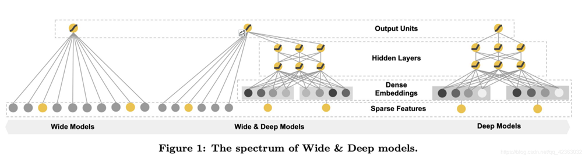
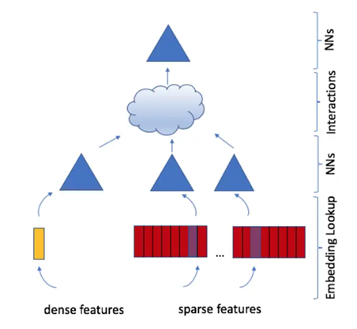
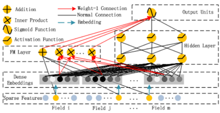
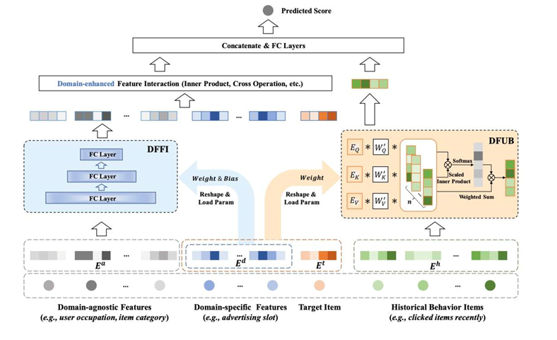
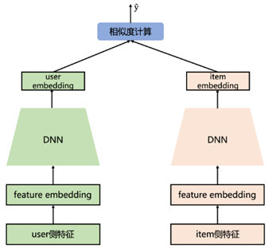
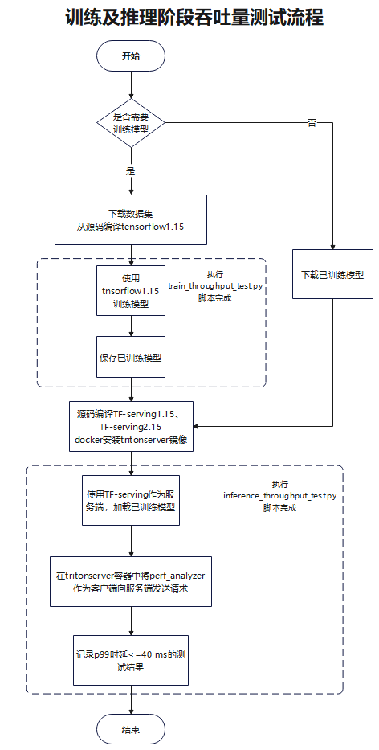
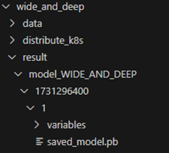

# DeepRec Model Zoo

## 测试背景
Benchmark测试，是一种衡量标准，用于确定和衡量性能的方法。它涉及设计科学的测试方法、测试工具和测试系统，以定量和可对比的方式对测试对象的性能、进行评估。该文档系统的介绍了搜推benchmark测试工具及其依赖的安装与使用，用于Modelzoo中搜推模型推理性能评估和验收测试。

Modelzoo是一个常用搜推模型的集合， 目前包括Wide_and_Deep、DLRM、DeepFM、DFFM和DSSM五个模型。为了对其推理阶段基准性能做个摸底，需要进行性能测试。测试涉及tensorflow，tensorflow-serving(TF-serving )，perf_analyzer(triton server)以及Modelzoo(DeepRec)中的模型代码。Modelzoo中的模型使用tensorflow进行开发及训练；训练后的模型文件使用TF-serving部署为服务端，perf_analyzer为客户端。
下面是对Modelzoo中模型的简单介绍。

### Wide_and_Deep
wide_and_deep(Wide & Deep Learning for Recommender Systems)模型是谷歌提出的一种用于推荐系统的机器学习架构，它结合了广度（线性模型）和深度（深度神经网络）。广度部分通过记忆已知的特征组合来捕捉稀疏数据中的显式关系，而深度部分则通过泛化来学习新的潜在特征交互。此架构能够同时处理高维稀疏和低维稠密特征，提升个性化推荐效果，适用于广告点击率预估等多种场景。



宽部分：通过线性层处理稀疏特征的交叉组合。

深部分：将one-hot编码后的类别、id类稀疏特征先通过embedding层获取低维向量后与归一化后的年龄、收入等稠密特征一起传给MLP。


### DLRM
DLRM（Deep Learning Recommendation Model）是Facebook提出的一种深度学习推荐模型，专为处理稀疏特征而设计。它采用嵌入层将高维稀疏特征转换为低维稠密向量，并通过交互层捕捉特征间的复杂关系。DLRM结合了低阶和高阶特征交互，利用点积操作计算特征组合，最后通过多层感知机（MLP）输出预测结果，广泛应用于广告推荐等个性化服务中。



离散特征：类别、id类的离散特征，对于这类特征通常是利用one-hot编码对其进行编码，生成稀疏特征；第二类为数值型的连续特征。对于第一类的离散特征，通过one-hot编码后会变得特别稀疏，深度学习模型是不适合从稀疏数据中学习的，通常的做法是通过Embedding将其映射成一个稠密的连续值

通过Embedding层后，所有的特征，包括离散特征和连续特征，可以通过MLP做进一步转换，如上图中的三角部分。经过MLP处理后进入到interaction特征交叉层。在interaction层，首先会将所有的embedding结果两两做点积，以此实现特征的交叉。然后将交叉后的特征和之前embedding结果组合在一起，以此同时实现了线形特征和交叉特征。最终通过MLP得到输出。

### DeepFM
DeepFM是2017年提出的CTR模型，是一种融合了因子分解机（FM）和深度神经网络（DNN）的推荐系统模型。它无需特征工程，自动学习特征组合。FM部分有效地捕捉特征间的二阶组合关系，而DNN部分则深入挖掘高阶特征交互。DeepFM在处理稀疏数据时表现出色，能够同时记忆已知组合并泛化新组合，适用于点击率预估、个性化推荐等场景。



与其他方法类似，稀疏特征进行one-hot编码后输入embedding层，稠密特征进行归一化。

FM:
线性部分——对原始特征进行加权求和。
二阶交互部分——通过内积操作捕捉所有特征之间的二阶交互。

DNN:
使用多层感知器提取高层次特征表示。

输出预测：合并 FM 和 DNN 的输出，并生成最终的推荐概率或回归值。

### DFFM
DFFM（Domain Facilitated Feature Modeling）模型是一种增强型推荐算法，它融合了领域感知与特征建模。通过引入领域信息，DFFM不仅考虑了特征间的交互，还强调了不同领域特征的重要性。该模型利用深度学习架构，在处理跨域数据时能够更精准地捕捉用户偏好和行为模式，提升推荐系统的准确性和个性化程度，尤其适用于多领域或跨平台的推荐场景。



特征分为域无关特征E<sup>*a*</sup>、域相关特征E<sup>*d*</sup>、目标item特征E<sup>*t*</sup>和历史行为特征E<sup>*h*</sup>。

其中E<sup>*a*</sup>和E<sup>*d*</sup>进行域增强内积后输入全连接层生成领域增强特征；E<sup>*d*</sup>和E<sup>*t*</sup>拼接后与E<sup>*h*</sup>进行注意力加权操作生成域辅助用户行为特征。将两类特征拼接后输入全连接层都得最后的结果。

### DSSM

DSSM（Deep Structured Semantic Model）是一种基于深度网络的语义模型，通过将user特征和item特征映射到公共维度的语义空间来计算相似度以预测点击的概率。



user特征和item特征均经过embedding层后由DNN生成公共维度语义空间中的向量表示，然后计算向量的相似度。


| Model                       | Paper                                                                                                                                                  |
|-----------------------------|--------------------------------------------------------------------------------------------------------------------------------------------------------|
| [WDL](wide_and_deep/README.md) | [DLRS 2016] [Wide & Deep Learning for Recommender Systems](https://arxiv.org/pdf/1606.07792.pdf)                                                       |
| [DLRM](dlrm/README.md)      | [ArXiv 2019] [Deep Learning Recommendation Model for Personalization and Recommendation Systems](https://arxiv.org/pdf/1906.00091.pdf)                 |
| [DSSM](dssm/README.md)      | [CIKM 2013] [Learning Deep Structured Semantic Models for Web Search using Clickthrough Data](https://posenhuang.github.io/papers/cikm2013_DSSM_fullversion.pdf) |
| [DeepFM](deepfm/README.md)  | [IJCAI 2017] [DeepFM: A Factorization-Machine based Neural Network for CTR Prediction](http://www.ijcai.org/proceedings/2017/0239.pdf)                 |
| [DFFM]     | [CIKM 2023] [DFFM: Domain Facilitated Feature Modeling for CTR Prediction](https://dl.acm.org/doi/abs/10.1145/3583780.3615469)|


## 测试原理
### 数据集

criteo-kaggle数据集[训练集](https://storage.googleapis.com/dataset-uploader/criteo-kaggle/large_version/train.csv)、[验证集](https://storage.googleapis.com/dataset-uploader/criteo-kaggle/large_version/eval.csv)和[taobao数据集](https://deeprec-dataset.oss-cn-beijing.aliyuncs.com/csv\_dataset/taobao.tar.gz)

Wide_and_deep、DLRM、DeepFM、DFFM使用criteo-kaggle数据集；dssm模型使用taobao数据集，该数据集中存在变长的特征，故将该特征删除。

### 测试套

tensorflow1.15+TF-serving2.15(1.15)+Modelzoo模型+perf_analyzer+cpu  使用内部编写的推理测试脚本。

### 测试流程



训练Modelzoo里的模型后分别使用单numa和整机进行推理阶段性能测试

#### 步骤一

进入Modelzoo所在路径
执行以下命令以训练并保存模型

```
python train_throughput_test.py --test_method single  --meta_path path --criteo_data_location /path/modelzoo/wide_and_deep/data  --taobao_data_location /path/modelzoo/dssm/data
```

其中

--test\_method 用于指定训练时所用的资源，single表示使用单numa，entire表示使用整机，默认使用单numa

--meta\_path 为modelzoo所在路径

-- criteo\_data\_location 为criteo-kaggle数据集所在位置

-- taobao\_data\_location 为taobao数据集所在位置

以wide\_and\_deep模型为例，训练并保存模型后，需要有如下结构所示的目录，variables文件夹和saved\_model.pb文件分别为保存的已训练模型的数据和模型结构



#### 步骤二

执行以下命令 ，即可对wide\_and\_deep，dlrm，deepfm，dffm，dssm五个模型进行推理阶段性能压测

```
python inference_throughput_test.py --test_method entire --meta_path /path --serving_path /path/to/tfserving --image nvcr.io/nvidia/tritonserver:24.05-py3-sdk --intra 1 --inter -1 --enable_XLA False --enable_oneDNN False
```

其中，

--test_method 用于指定训练时所用的资源；single表示使用单numa，限制为使用numa0；entire表示使用整机；默认使用整机

--meta_path 为modelzoo所在路径

--serving_path 为TF-serving的可执行二进制文件所在路径

--image 为用于执行压测的tritonserver的容器名称及版本

--intra tensorflow_intra_op_parallelism tensorflow算子内并行线程数，默认为0

--inter tensorflow_inter_op_parallelism tensorflow算子间并行线程数，默认为0

--enable_oneDNN 使能oneDNN，默认为False


## 基线结果
920高性能版整机性能测试结果（为避免网络带宽影响，serving端和client部署在同一台服务器上）

### 原生TF-serving2.15

|               | 并发数     | batch size | intra | inter | thoughput         |
|---------------|---------|------------|-------|-------|-------------------|
| Wide_and_Deep | 40:64:4 | 64         | 0     | 0     | 600838 infer/sec  |
| DLRM          | 44:68:4 | 256        | 0     | 0     | 2407724 infer/sec |
| DeepFM        | 28:48:4 | 256        | 0     | 0     | 1631908 infer/sec |
| DFFM          | 24:44:4 | 128        | 0     | 0     | 706571 infer/sec  |
| DSSM          | 36:56:4 | 512        | 0     | 0     | 3499545 infer/sec |

