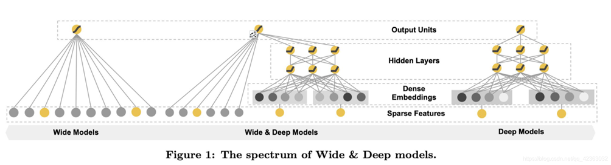
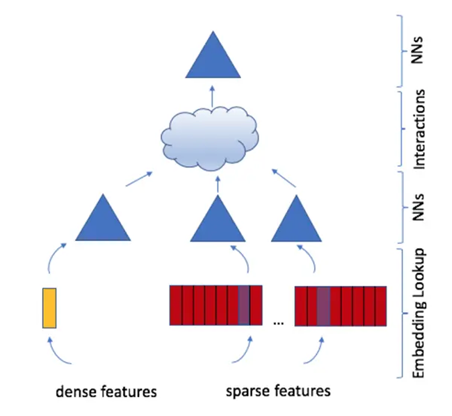
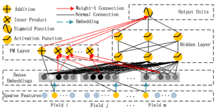
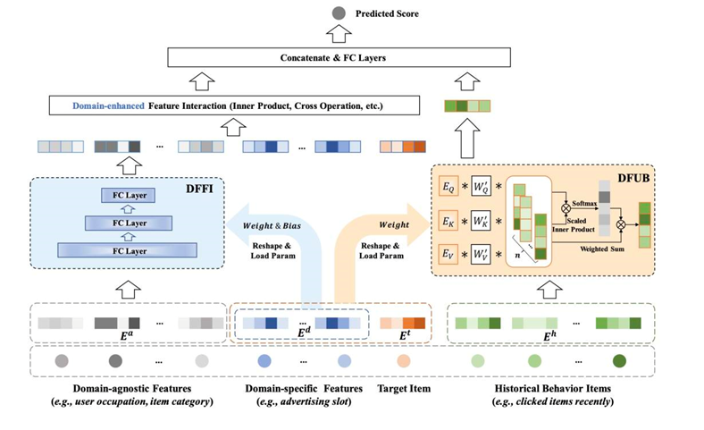
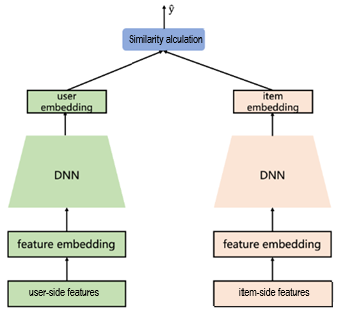
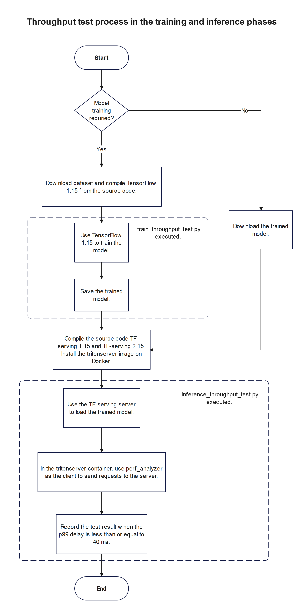
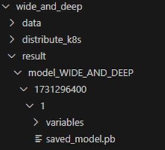

# DeepRec Model Zoo

## Background

Benchmark testing is a standard method used to determine and measure performance. It leverages scientifically designed testing frameworks, tools, and environments to assess target performance quantitatively and comparably. This document provides a systematic guide to installing and using the search and recommendation benchmark tool and its dependencies. It is designed for evaluating and acceptance-testing the inference performance of search and recommendation models within the Modelzoo framework.

Modelzoo is a collection of popular search and recommendation models, currently including Wide & Deep Learning for Recommender Systems (Wide_and_Deep), Deep Learning Recommendation Model (DLRM), DeepFM, Domain Facilitated Feature Modeling (DFFM), and Deep Structured Semantic Model (DSSM). Performance testing is required to establish a baseline for their inference phase. The benchmarks involve TensorFlow, TensorFlow Serving (TF-Serving), perf_analyzer (Triton Server), and model code from Modelzoo (DeepRec). Models in Modelzoo are developed and trained using TensorFlow; trained models are deployed as a server using TF-Serving, with perf_analyzer acting as the client.
Below is a brief overview of the models in Modelzoo.

### Wide_and_Deep

The Wide_and_Deep model is a machine learning architecture introduced by Google for recommender systems. It combines width (linear models) and depth (deep neural networks). Linear models capture explicit relationships in sparse data by memorizing known feature combinations, while deep neural networks learn new potential feature interactions through generalization. This architecture can process both high-dimensional sparse features and low-dimensional dense features to facilitate personalized recommendation. It is applicable to various scenarios such as ad click-through rate (CTR) estimation.



Wide models: Process the cross combination of sparse features through the linear layer.

Deep models: Obtain the low-dimensional vectors of the one-hots of the sparse features such as category and ID type through the embedding layer. Send the low-dimensional vectors obtained together with the normalized dense features such as age and income to the MLP.

### DLRM

DLRM is a deep learning recommendation model proposed by Facebook. This model is designed to process sparse features. It uses the embedding layer to convert high-dimensional sparse features into low-dimensional dense vectors, and captures complex relationships between features through the interaction layer.DLRM combines low-order and high-order feature interaction, uses the dot product to calculate feature combinations, and outputs prediction results through the multi-layer perceptron (MLP). DLRM is widely used in personalized services such as advertising and recommendation.



Discrete features: categorical and ID features. These features are typically encoded using one-hot encoding to generate sparse features. The second type is numerical continuous features. Discrete features become particularly sparse after one-hot encoding, which is not suitable for the deep learning model to learn from. Generally, the discrete features are mapped to dense continuous values through embeddings.

After the embeddings are applied, all features, including discrete features and continuous features, can be further converted through the MLP, as shown in the triangle part in the above figure. The features processed by the MLP then enter the interaction layer for feature crossing. At the interaction layer, the dot product is performed on every two of the embedding results to implement feature crossing. Then, the crossed features are combined with the previous embedding results to implement both linear and crossed features. Finally, the output is obtained through the MLP.

### DeepFM

DeepFM is a CTR model proposed in 2017. It is a recommendation system model that integrates the factorization machine (FM) and deep neural networks (DNNs).This model automates feature combination learning, removing the burden of feature engineering. Its FM effectively captures the second-order combination relationship between features, while the DNNs deeply explores the high-order feature crosses. DeepFM has excellent performance in processing sparse data and can memorize known combinations and generalize new combinations, which is applicable to scenarios such as CTR estimation and personalized recommendation.



Similar to other methods, one-hot encoding is performed on the sparse features, and then the sparse features are input into the embedding layer, while the dense features are normalized.

FM:
Linear part: Weighted summation of raw features.
Second-order crossing: Second-order crosses between all features are captured through the inner product.

DNN:
MLP is used to extract high-order feature representations.

Output prediction: Combine the outputs of FM and DNN, and generate the final recommendation probability or regression value.

### DFFM

DFFM is an enhanced recommendation algorithm that integrates domain awareness and feature modeling. By introducing domain information, DFFM emphasizes the importance of different domain features besides considering the crossing between features. This model uses the deep learning architecture to accurately capture user preferences and behavior patterns during cross-domain data processing, improving the accuracy and personalization of the recommendation system. It is especially applicable to multi-domain or cross-platform recommendation scenarios.



Features are classified into domain-agnostic feature E<sup>*a*</sup>, domain-specific feature E<sup>*d*</sup>, target item feature E<sup>*t*</sup>, and historical behavior feature E<sup>*h*</sup>.

Where E<sup>*a*</sup> and E<sup>*d*</sup> undergo domain-augmented inner product before being fed into a fully connected layer to generate domain-augmented features; E<sup>*d*</sup> and E<sup>*t*</sup> are concatenated and then attention-weighted with E<sup>*h*</sup> to generate domain-auxiliary user behavior features. The two types of features are concatenated and input into a fully connected layer to yield the final results.

### DSSM

DSSM is a semantic model based on the deep network. It calculates a similarity by mapping user features and item features to the semantic space of the common dimension to predict the CTR.



After both the user features and item features pass through the embedding layers, the DNNs generate vector representations in the semantic space of the common dimension, and then calculate a similarity of the vectors.

| Model                       | Paper                                                                                                                                                  |
|-----------------------------|--------------------------------------------------------------------------------------------------------------------------------------------------------|
| [WDL](wide_and_deep/README.md) | [DLRS 2016] [Wide & Deep Learning for Recommender Systems](https://arxiv.org/pdf/1606.07792.pdf)                                                       |
| [DLRM](dlrm/README.md)      | [ArXiv 2019] [Deep Learning Recommendation Model for Personalization and Recommendation Systems](https://arxiv.org/pdf/1906.00091.pdf)                 |
| [DSSM](dssm/README.md)      | [CIKM 2013] [Learning Deep Structured Semantic Models for Web Search using Clickthrough Data](https://posenhuang.github.io/papers/cikm2013_DSSM_fullversion.pdf) |
| [DeepFM](deepfm/README.md)  | [IJCAI 2017] [DeepFM: A Factorization-Machine based Neural Network for CTR Prediction](http://www.ijcai.org/proceedings/2017/0239.pdf)                 |
| [DFFM]     | [CIKM 2023] [DFFM: Domain Facilitated Feature Modeling for CTR Prediction](https://dl.acm.org/doi/abs/10.1145/3583780.3615469)|

## Test Principles

### Dataset

Criteo-Kaggle [training dataset](https://storage.googleapis.com/dataset-uploader/criteo-kaggle/large_version/train.csv) and [validation dataset](https://storage.googleapis.com/dataset-uploader/criteo-kaggle/large_version/eval.csv), and [Taobao dataset](https://deeprec-dataset.oss-cn-beijing.aliyuncs.com/csv\_dataset/taobao.tar.gz)

Wide_and_Deep, DLRM, DeepFM, and DFFM use the Criteo-Kaggle dataset; the DSSM model uses the Taobao dataset, where variable-length features have been removed.

### Test Suite

TensorFlow 1.15 + TF-serving 2.15 (1.15) + ModelZoo model + perf_analyzer + CPU: Use the internally compiled inference test script.

### Test Procedure



After training a model in ModelZoo, use a single NUMA node and the entire system to test the inference performance.

#### Step 1

Go to the directory where ModelZoo is located.
Run the following command to train and save the model:

```bash
python train_throughput_test.py --test_method single  --meta_path path --criteo_data_location /path/modelzoo/wide_and_deep/data  --taobao_data_location /path/modelzoo/dssm/data
```

Where

`--test_method` indicates the resources used during training. `single` indicates that a single NUMA node is used and `entire` indicates that the entire system is used. By default, a single NUMA node is used.

`--meta_path` indicates the path of ModelZoo.

`--criteo_data_location` indicates the location of the Criteo-Kaggle dataset.

`--taobao_data_location` indicates the location of the Taobao dataset.

Using the Wide_and_Deep model as an example, once the model is trained and saved, the directory must follow the structure below. The `variables` folder and `saved_model.pb` file contain the trained model weights and architecture, respectively.



#### Step 2

Run the following command to benchmark inference performance for Wide_and_Deep，DLRM, DeepFM, DFFM and DSSM.

```bash
python inference_throughput_test.py --test_method entire --meta_path /path --serving_path /path/to/tfserving --image nvcr.io/nvidia/tritonserver:24.05-py3-sdk --intra 1 --inter -1 --enable_XLA False --enable_oneDNN False
```

Wherein:

`--test_method` indicates the resources used during training. `single` indicates that a single NUMA node is used, and the restriction is that only NUMA0 can be used. `entire` indicates that the entire system is used. By default, the entire system is used.

`--meta_path` indicates the path of ModelZoo.

`--serving_path` indicates the path of the executable binary file of TF-serving.

`--image` indicates the name and version of the TritonServer container used for the stress test.

`--intra tensorflow_intra_op_parallelism` indicates the number of parallel threads within a TensorFlow operator. The default value is `0`.

`--inter tensorflow_inter_op_parallelism` indicates the number of parallel threads between TensorFlow operators. The default value is 0.

`--enable_oneDNN` enables oneDNN. The default value is `False`.

## Baseline Result

Performance test results of the 920 high-performance edition (To avoid the impact of network bandwidth, the serving and client are deployed on the same server.)

### Native TF-serving 2.15

|               | Concurrency     | Batch Size | Intra | Inter | Thoughput         |
|---------------|---------|------------|-------|-------|-------------------|
| Wide_and_Deep | 40:64:4 | 64         | 0     | 0     | 600838 infer/sec  |
| DLRM          | 44:68:4 | 256        | 0     | 0     | 2407724 infer/sec |
| DeepFM        | 28:48:4 | 256        | 0     | 0     | 1631908 infer/sec |
| DFFM          | 24:44:4 | 128        | 0     | 0     | 706571 infer/sec  |
| DSSM          | 36:56:4 | 512        | 0     | 0     | 3499545 infer/sec |
